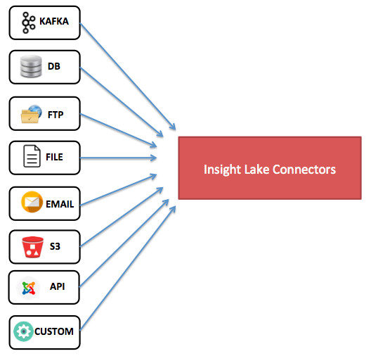

# Visualization on steroids

## Insight Lake Dashboard Solution
There are many visualization tools out there - Tableau, Microstrategy, Qlik, Apache Zeppelin and may more. Then why would we need another visualization solution. We thought about the same but as we were building a comprehensive unified data platform visualization was a core component. Visualization solution is integrated with our metadata, security and governance layer seamlessly.

## A powerful, flexible visualization solution
Dashboard solution is built to enable organizations quickly explore, analyze patterns and build dashboards with rich visualization charts. Dashboards can use real time charts, ad-hoc queries or periodic data refreshes. It provides drill down capability, exploration of chart data, data dictionary and data lineage to give complete view to the user. Solution integrates with Metadata Hub and Data Governance solutions. Role and user based access is allowed at individual chart level.

## Interactive Dashboard Builder
Visual builder provides drag and drop features to build charts very easily. Any data source could be used like Kafka, Database, SOLR, Elastic Search etc. Fields from data source can be dropped on the data section. Complex fields (derived fields) can be built using rich function library. Different filters like numeric, string, date time etc can be applied easily. Finally properties can be used to create different charts like Histogram, Pie, Map etc..

## Dashboard Groups and Panels

## Supported Charts

Basic charts - Pie, Histogram, Horizontal Bar, Line, Heatmap, Donut, Table...
Map - USA, World, Real time connections map
Pivot, Word Map
Summary - show executive summary
Tree - show path flows
Funnel - show funnel analysis
Force directed - show connected components
Linked Table - Connect dashboards together to create nice data story

## Connect to many data sources

Dashboard solution collects data from various sources using integrated metadata layer.

Data sources can be real time sources like Kafa or persistent stores like databases, HDFS, S3, SOLR, Elastic Search etc.

A new query language was defined to work with these data sources seamlessly.

## Enrich & build complex data sets
InsightLake platform's metadata layer on data sets and query language allows creation of simple and complex data sets, which can then be used for dashboards. Users can do the following:

Create derived fields
Create new data set by doing Join, Union or Transpose
Apply custom queries

## Rich dashboards
Users can build a nice data story by putting various charts in a dashboard. They can customize the look and feel of the dashboard panels easily.

## Drill down capability
Business users can use drill down feature and narrow down to data elements to get the clarity. They can simply click on chart elements like bar of bar chart, Pie of Pie chart, Table row, Map state or country etc and selected filter gets applied to relevant charts of the dashboard, which then redraws all the charts taking only filtered data.

## Auto dashboard suggestions
Dashboard solution speeds up chart building with automatic dashboard suggestion feature. It allows users to select appropriate data source and data store (Table, Kafka Topic, File etc) and backend automation algorithm understands the data and suggests set of dashboards/charts, which can be easily added to a new report with button click.

## Build Realtime Dashboards
Business users can build operational dashboards where real time events are fed to charts, which gets updated in real time. For example using real time dashboard users can build charts on Kafka events and show how them live on dashboards.

Fast charts can be built using periodic refresh mode. In this mode backend engine refreshes the data and charts periodically. Users can turn on or off this feature using a simple click on real time icon on charts.

## Explore Data Dictionary & Lineage
When business users are looking at the charts, it's critical for them to understand from where the data came from and what fields mean. Trust and quality is the core for any dashboard to provide any value to end user.

Data Dictionary : Dashboard solution's data dictionary integration allows users to click on the chart and see the data dictionary. They can understand from where data has been pulled and if fields are confidential, what meaning they carry for given business domain etc.

Data Lineage : Business users can leverage lineage feature to see from where data came from and what are the sources and processes, which transformed the data.

## Integrate R in dashboards
R is a language and environment for statistical computing. R provides a wide variety of statistical (linear and nonlinear modeling, classical statistical tests, time-series analysis, classification, clustering etc.). InsightLake Dashboard Solution integrates with R environment using RServe and allows building charts using R Scripts.

## PDF & Confluence Reports
Any dashboard can be downloaded as PDF or PNG, which helps business users share information with each other or include the dashboards in their documents easily.

Confluence report generation allows easy integration and sharing with wider teams. Report allows user collaboration and discussion on dashboard reports easily.

## Dashboard Automation
Dashboards can be automated which enables business users to do:

Automate data extraction periodically from data sources
Generation of PDF, PNG or Confluence report page.
Email generated dashboard to specified user group

## Secure Dashboard Access at Chart Level

Dashboard access can be provisioned for users or user groups at dashboard or individual chart level. If a user is not allowed to see certain chart then that panel is not rendered.

To learn more, check out [http://insightlake.com/dataexplorer.html](http://insightlake.com/dataexplorer.html)

Installation
------
* Download or clone the repository. 
* Run bin/insightlake command.
* Open browser with URL as http://localhost:8080/
* Change configuration in /conf folder to set different ports
* By default H2 database is used, you can change the database details in jdbc.properties file

License
------
InsightLake Data Explorer is a commercial product but distributed to be used freely. Please contact contact@insightlake.com for details.

Getting Help
----------

You can get help easily :
Community - Google Groups
Slack Channel
Twitter
Facebook
Email: contact@insightlake.com
